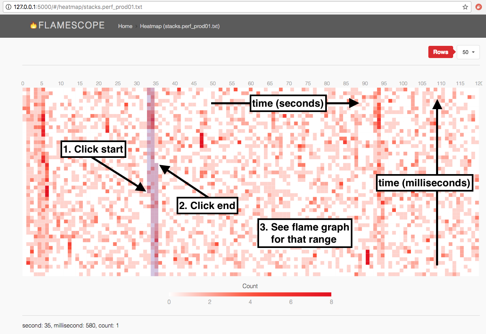

# FlameScope



[](https://gitter.im/flamescope)
[](https://travis-ci.org/Netflix/flamescope)
[]()
[](http://www.apache.org/licenses/LICENSE-2.0)

FlameScope is a visualization tool for exploring different time ranges as Flame Graphs, allowing quick analysis of performance issues such as perturbations, variance, single-threaded execution, and more.

FlameScope begins by displaying the input data as an interactive subsecond-offset heat map. This shows patterns in the data. You can then select a time range to highlight on different patterns, and a flame graph will be generated just for that time range.

## Disclaimer

FlameScope is in early stages of development and under constant change, so bugs and issues are expected. We count on your support to find and report them!

## Installation / Instructions

The quickest way to get started is to run the pre-built client bundle:

```bash
$ git clone https://github.com/Netflix/flamescope
$ cd flamescope
$ pip install -r requirements.txt
$ python run.py
```

Then browse to http://127.0.0.1:5000/, and you can begin exploring profiles from the `examples` directory. You can add new profiles to that directory, collected using Linux `perf`. Here are instructions for a generic CPU profile at 49 Hertz for 120 seconds:

```bash
$ sudo perf record -F 49 -a -g -- sleep 120
$ sudo perf script --header > stacks.myproductionapp.2018-03-30_01
$ gzip stacks.myproductionapp.2018-03-30_01	# optional
```

There are extra steps to fetch stacks correctly for some runtimes, depending on the runtime. For example, we've previously published Java steps in [Java in Flames](https://medium.com/netflix-techblog/java-in-flames-e763b3d32166): java needs to be running with the -XX:+PreserveFramePointer option, and [perf-map-agent](https://github.com/jvm-profiling-tools/perf-map-agent) must be run immediately after the `perf record` to dump a JIT symbol table in /tmp.

FlameScope can visualize any Linux `perf script` output that includes stack traces, including page faults, context switches, and other events. See the References section below for documentation.

FlameScope is composed of two main components, the Python backend, and a React client interface. A pre-built client bundle is distributed with the backend, so the quickest way to get started is to install the Python requirements and start the application, as described earlier.

Although not necessary, we **strongly** suggest using [virtualenv](https://github.com/pypa/virtualenv) to isolate your Python environment.

By default, FlameScope will load a list of files from the `examples` directory, which includes a two profile examples.

## Configuration Options

FlameScope configuration file can be found in `app/config.py`.

```python
DEBUG = True # run the web server in debug mode
STACK_DIR = 'examples' # path where flamescope will look for profiles
HOST = '127.0.0.1' # web server host
PORT = 5000 # web server port
JSONIFY_PRETTYPRINT_REGULAR = False # pretty print api json responses
```

## Building Client from Source

In order to build the client application from source, the following command line tools must be installed:

- [Node.js/Npm](https://nodejs.org/en/download/)
- [Yarn](https://yarnpkg.com/lang/en/docs/install/)

Once those tools are available, you will be able to install the project dependencies and generate a build.

```bash
$ yarn install
$ npm run webpack
```

The `npm run webpack` command will generate a new build under `app/public`. This directory is exposed by the Python web server.

Webpack can also watch and recompile files whenever they change. To build and start the _watch_ task, run the following command:

```bash
$ npm run webpack-watch
```

## Building a Docker Image

FlameScope provides a Dockerfile to build a Docker image:

```bash
$ cd flamescope
$ docker build -t flamescope .
```

The container expects the profiles to be bind-mounted into `/stacks` and listens on port 5000. To view profiles from `/tmp/stacks`, start the container with the following command:

```
$ docker run --rm -it -v /tmp/stacks:/stacks:ro -p 5000:5000 flamescope
```

Then access FlameScope on [http://127.0.0.1:5000](http://127.0.0.1:5000/)

## References

- [FlameScope Introduction (video)](https://www.youtube.com/watch?v=cFuI8SAAvJg)
- [FlameScope Examples (video)](https://www.youtube.com/watch?v=gRawd7CO-Q8)
- [Flame Graphs](http://www.brendangregg.com/flamegraphs.html)
- [Java in Flames](https://medium.com/netflix-techblog/java-in-flames-e763b3d32166)
- [Subsecond-offset Heat Maps](http://www.brendangregg.com/HeatMaps/subsecondoffset.html)
- [Linux perf kernel docs](https://github.com/torvalds/linux/tree/master/tools/perf/Documentation)
- [Linux perf wiki](https://perf.wiki.kernel.org/index.php/Main_Page)
- [Linux perf examples](http://www.brendangregg.com/perf.html)
