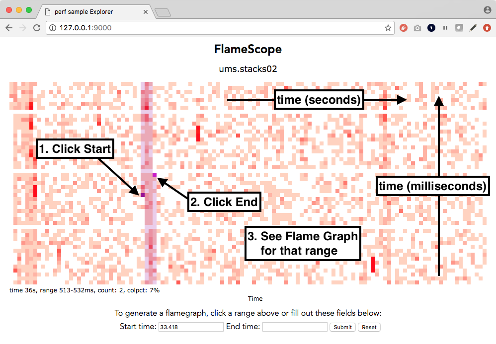

# FlameScope



[](https://travis-ci.org/Netflix/flamescope)
[]()
[](http://www.apache.org/licenses/LICENSE-2.0)

FlameScope is a visualization tool for exploring different time ranges as Flame Graphs, allowing quick analysis of performance issues such as perturbations, variance, single-threaded execution, and more.

FlameScope begins by displaying the input data as an interactive subsecond-offset heat map. This shows patterns in the data. You can then select a time range to highlight on different patterns, and a flame graph will be generated just for that time range.

## Disclaimer

FlameScope is in early stages of development and under constant change, so bugs and issues are expected. We count on your support to find and report them!

## Getting Started

FlameScope is composed of two main components, the Python backend, and a React client interface. A pre-built client bundle is distributed with the backend, so to get started, you just need to install the Python requirements and start the application.

```bash
$ pip install -r requirements.txt
$ python run.py
```

Altough not necessary, we **strongly** suggest using [virtualenv](https://github.com/pypa/virtualenv) to isolate your Python environment.

By default, FlameScope will load a list of files from the `examples` directory, which includes a two profile examples.

## Configuration Options

FlameScope configuration file can be found in `app/config.py`.

```python
DEBUG = True # run the web server in debug mode
STACK_DIR = 'examples' # path where flamescope will look for profiles
HOST = '127.0.0.1' # web server host
PORT = 5000 # web server port
JSONIFY_PRETTYPRINT_REGULAR = False # pretty print api json responses
```

## Generating Profiles

FlameScope relies on `perf script` output files to build both heatmap and flame graphs visualizations. Refer to ...

## Building Client from Source

In order to build the client application from source, the following command line tools must be installed:

- [Node.js/Npm](https://nodejs.org/en/download/)
- [Yarn](https://yarnpkg.com/lang/en/docs/install/)

Once those tools are available, you will be able to install the project dependencies and generate a build.

```bash
$ yarn install
$ npm run webpack
```

The `npm run webpack` command will generate a new build under `app/public`. This directory is exposed by the Python web server.

Webpack can also watch and recompile files whenever they change. To build and start the _watch_ task, run the following command:

```bash
$ npm run webpack-watch
```

## References

- [Flame Graphs](http://www.brendangregg.com/flamegraphs.html)
- [Subsecond-offset Heat Maps](http://www.brendangregg.com/HeatMaps/subsecondoffset.html)
